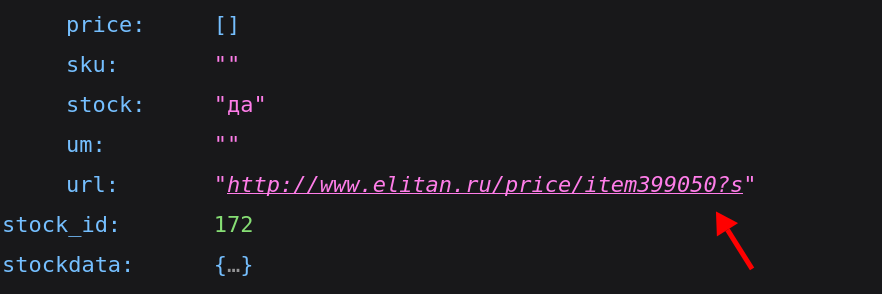

# Технические требования для BOM verifier

Цель: Разработать микропрограмму осуществляющую проверку списка материалов (BOM). Требуется проверить консистентность данных, определить их наличие и цену у поставщика. Сформировать новый перечень материалов. 

Требование к реализации:

- Язык программирования `python3`

- Отсутствие внешних зависимостей для `python`, разрешено использовать только встроенные модули (возможно отклонение по согласованию)

- Программа должна запускаться и выполнять свою функцию в среде контейнера `ghcr.io/kicad/kicad:9.0`

- Программа должна иметь интерфейс управления посредством флагов командной строки

- Программа должна принимать/выдавать файл соответствующий примеру (см. ниже)

- Программа должна иметь возможность задания `user-agent`, посредством указания значения в переменной (строка).

- Добавление новых столбцов (не описанных в примере) не должно приводить к сбою работы программы

- В случае отсутствия столбца/значения программа должна продолжить свою функционирование, выведя при этом предупреждение.

- Все столбцы из входного файла должны быть сохранены в выходном файле

- Программа должна быть не чувствительна к регистру заголовка столбцов

- Требуется поддержка поставщиков lcsc, promelec, elitan

- Предусмотреть возможность включения задержки между забросами к api (рас комментировать в коде) 

- В ходе работы в `stdout` должна отправляться информацию об выполненных/проваленных операциях

- Все не допустимые комбинации аргументов или неверные значения должны выдавать ошибку и завершать работу программы

- В случае если `API` возвращает несколько подходящих деталей, берем первую в списке если `stock != 0`, ищем позицию с наибольшим количеством

## Аргументы

```bash
pythone3 bomVerifier.py -o newBOM.csv \ # куда сохранить новый bom
-lcsc=type \ # осуществляет процессинг для lcsc (строка)
-lcscRW=type \ # принудительно перезаписать то что указано в type (строка)
-promelec \ # осуществляет процессинг для promelec
-elitan \ # осуществляет процессинг для elitan
-qty=num \ # количество изделий в заказу (число > 0) (по умолчанию)
bom.csv
```

- Все флаги кроме `-o` являются не обязательными.

- Где `type` это `pn` или `sku` или `none`. Параметр определяет по какому полю будет осуществятся поиск.  `promelec` и `elitan` всегда ищут по `pn` или не ищут совсем.

- Заблокировать ситуацию когда `lcsc` = `lcscRW` = `type`

- Флаг `-qty` создает столбец `qty_total` содержащие `qty`

## i/o

Структура входного файла:

| Qty | pn                | Designator | Value     | Coefficient | Voltage | Footprint                        | chipdip    | elitan     | lcsc   | promelec |
| --- | ----------------- | ---------- | --------- | ----------- | ------- | -------------------------------- | ---------- | ---------- | ------ | -------- |
| 2   | CC0805KRX7R9BB104 | C1,C6      | 100n      | X7R         | 50v     | 0805                             | 9000121574 |            | C49678 | 124545   |
| 1   | STM32F103C8T6     | U3         | STM32F103 |             |         | Package_QFP:LQFP-48_7x7mm_P0.5mm |            | item399050 | C8734  | 126937   |

Структура выходного файла:

`...` - столбцы ВХодного файла

`---` - столбцы для других поставщиков

| ... | qty_total | lcsc_sku | lcsc_mpn          | lcsc_stock | lcsc_price  | lcsc_consistent | lcsc_enough | --- |
| --- | --------- | -------- | ----------------- | ---------- | ----------- | --------------- | ----------- | --- |
| ... | 2         | С49678   | CC0805KRX7R9BB104 | 10035215   | 0.004385714 | true            | true        | --- |
| ... | 1         | С8734    | STM32F103C8T6     | 133623     | 1.174285714 | true            | true        | --- |

## External API

### promelec

```
https://efind.ru/ajax/efapi/search?id=65,1794&stock=1&search=!!СЮДА PN!!&tm=15&hp=1&cur=usd
```

Описание: https://efind.ru/services/api

Тут можно потыкать: https://efind.ru/services/api/example

Требуемые поля:

|                                                               |                     |
| ------------------------------------------------------------- | ------------------- |
| sku                                                           | promelec_sku        |
| part                                                          | promelec_mpn        |
| stock                                                         | promelec_stock      |
| price                                                         | promelec_price      |
| истина если совпадают promelec/promelec_sku и pn/promelec_mpn | promelec_consistent |
| истина если qty_total <= promelec_stock                       | promelec_enough     |

### elitan

```
https://efind.ru/ajax/efapi/search?id=172&stock=1&search=!!СЮДА PN!!&tm=15
```

Заметка: elitan не дает информацию о цене и количестве, выдает бинарное значение ЕСТЬ/НЕТ. 

Описание: https://efind.ru/services/api

Тут можно потыкать: https://efind.ru/services/api/example

Требуемые поля:

|                                                         |                   |
| ------------------------------------------------------- | ----------------- |
|                | elitan_sku        |
| part                                                    | elitan_mpn        |
| истина если совпадают elitan/elitan_sku и pn/elitan_mpn | elitan_consistent |
| stock                                                   | elitan_enough     |

### lcsc

Заметка: в api есть ошибка, mfr это mpn. Значения поля lcsc не содержат в начале символа`C*` 

Описание: [GitHub - tscircuit/jlcsearch](https://github.com/tscircuit/jlcsearch)

Тут можно потыкать: https://jlcsearch.tscircuit.com/components/list?search=STM32F103C8T6

Требуемые поля:

|                                                   |                 |
| ------------------------------------------------- | --------------- |
| lcsc                                              | lcsc_sku        |
| mfr                                               | lcsc_mpn        |
| stock                                             | lcsc_stock      |
| price1                                            | lcsc_price      |
| истина если совпадают lcsc/lcsc_sku и pn/lcsc_mpn | lcsc_consistent |
| истина если qty_total <= lcsc_stock               | lcsc_enough     |

# 
