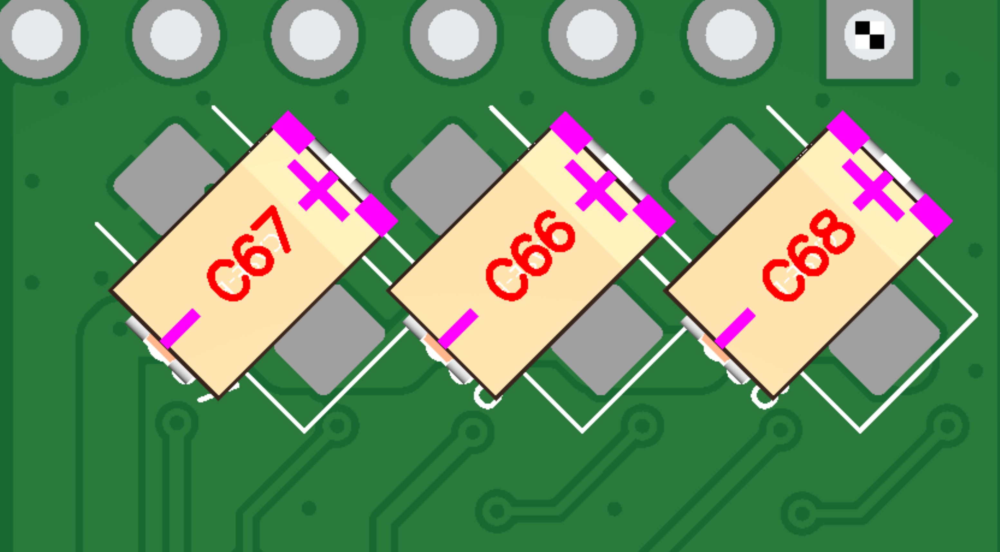
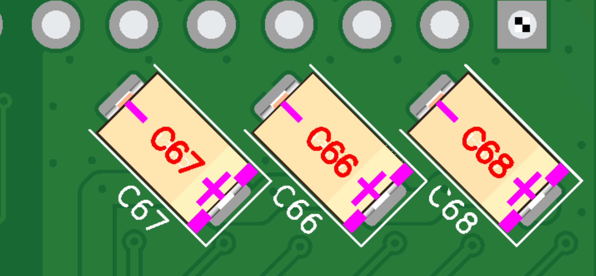

# Технические требования для CPL corrector

**Цель**: Разработать микропрограмму осуществляющую коррекцию файла размещение (CPL). Тем самым снизить брак и затраты на подготовку к производству.

**Предметная область**: Производства печатных плат (ПП, PCB). Сборка печатных плат осуществляется на автоматизированных линиях (THT, SMT). Для станков автоматизированной линии нужна программа (G-code), генерируемый из `CPL`+`BOM` файла.

**Проблема**: Каждый производитель имеет собственную конфигурацию оборудования и базу данных элементов. Единого стандарта определения системы координат нет, в следствии чего, требуется ручная коррекция позиций и ориентаций деталей. 

**Пример**:

Без коррекции:

после коррекции:



### Требование к реализации:

- Язык программирования `python3`

- Отсутствие внешних зависимостей для `python`, разрешено использовать только встроенные модули (возможно отклонение по согласованию)

- Программа должна запускаться и выполнять свою функцию в среде контейнера `ghcr.io/kicad/kicad:9.0`

- Программа должна иметь интерфейс управления посредством флагов командной строки

- Программа должна принимать/выдавать файл соответствующий примеру (см. приложение)

- Добавление новых столбцов в исходном файле (не описанных в примере) не должно приводить к сбою работы программы

- В случае отсутствия столбца/значения программа должна продолжить свою функционирование, выводя при этом предупреждение.

- Все столбцы из входного файла должны быть сохранены в выходном файле

- Программа должна быть не чувствительна к регистру заголовка столбцов
  
  В ходе работы в `stdout` должна отправляться информацию об выполненных/проваленных операциях

- Все не допустимые комбинации аргументов или неверные значения должны выдавать ошибку и завершать работу программы

- Файлы входные/выходные в кодировке `unix`/`utf8`

- Лог программы должен быть информативным, не уведомляй о очевидных вещах

- Вся программа должна состоять из одного файла

## Аргументы

```bash
python3 cplСorrector.py 
sfc_hardware_v0.2.2_cpl.csv \ # файл требующий корекции
correction_cpl.csv \ # файл описывающий корекции
-o sfc_hardware_v0.2.2_fix_cpl.csv \ # результирующий файл
```

- Все флаги кроме `-o` являются обязательными.

## I/O

См. приложения, там уже есть часть программы и примеры входных/выходных данных.

### Что требуется

- Сделать так что результирующий файл унаследовал структуру столбцов из исходного (сейчас за 'хардкожено' какие столбцы будут в выходном файле)

- Реализовать механизм коррекции по координатном, по аналогии с вращением. (столбцы 'Mid X','Mid Y'). Логика работы примитивна, приплюсовать значения из файла коррекций к соответствующим строкам.

- Добавить возможность коррекции не только по Package, но и по Designator. Если один и тот же элемент удовлетворяет и Package и Designator. Выполнить коррекцию один раз.

- Реализовать механизм позволяющий использовать регулярные выражения в столбцах  Package, Designator. 
  
  - например: `LED_D*`  где * это любой количество любых символов
  
  - например: `LED_D?` где ? это 1 любой символов 
  
  - например: `LED_D?.?mm` в него входят и LED_D3.0mm и LED_D1.0mm и LED_D9.2mm и т.д

- Реализовать механизм проверки `correction_cpl` по столбцам (Package, Designator), в одном столбце не должно быть 2х выражений попадающих в одно множество. Уведомить об этом в `stderr`
