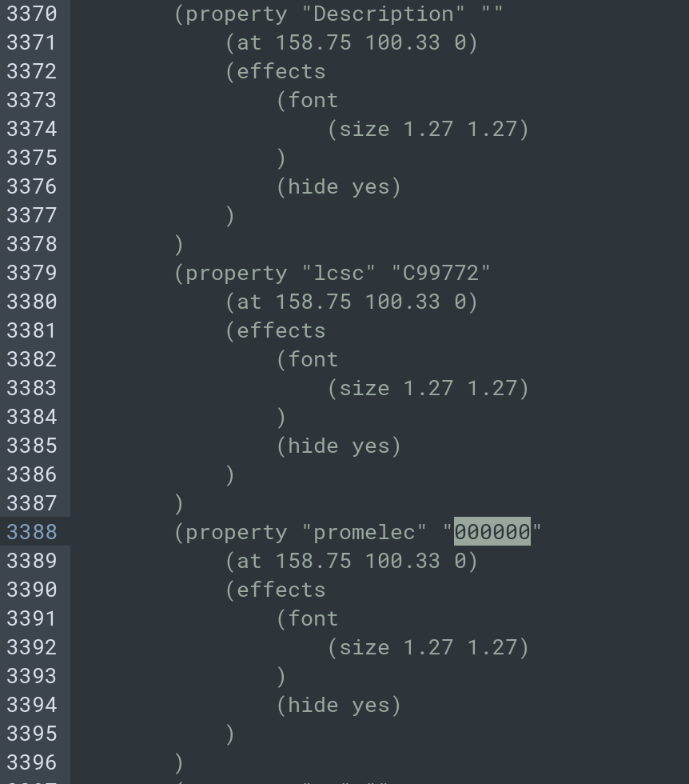

# Технические требования для schPropEdit

**Цель**: Разработать микропрограмму осуществляющую изменения полей в kicad схеме.

### Аргументы:

```bash
python schPropEdit.py "ФАЙЛ" \
    -s "ИСКОМЫЙ ПАРАМЕТР" \
    -sv "ЗНАЧЕНИЕ ИСКОМОГО ПАРАМЕТРА" \
    -c "ПАРАМЕТР ТРЕБУЮЩИЙ ИЗМЕНЕНИЯ" \
    -cv "ЗНАЧЕНИЕ, КОТОРОЕ СЛЕДУЕТ УСТАНОВИТЬ"
```

Примеры команд:

```bash
python schPropEdit.py file.kicad_sch \
    -s "lcsc" \
    -sv "C99772" \
    -c "promelec" \
    -cv "000000"
```



Если "ПАРАМЕТР ТРЕБУЮЩИЙ ИЗМЕНЕНИЯ" не существует создать его аналогичным "ИСКОМЫЙ ПАРАМЕТР" в соответствии с структурой файла.

### Требование к реализации:

- Язык программирования `python3`

- Отсутствие внешних зависимостей для `python`, разрешено использовать только встроенные модули (возможно отклонение по согласованию) (доступен `pyparsing`)

- Программа должна запускаться и выполнять свою функцию в среде контейнера `ghcr.io/kicad/kicad:9.0`

- Программа должна иметь интерфейс управления посредством флагов командной строки

- Программа должна принимать/выдавать файл соответствующий примеру (см. приложение)

- В ходе работы в `stdout` должна отправляться информацию об выполненных/проваленных операциях. 

- Все не допустимые комбинации аргументов или неверные значения должны выдавать ошибку и завершать работу программы

- Файлы входные/выходные в кодировке `unix`/`utf8`

- Вся программа должна состоять из одного файла
