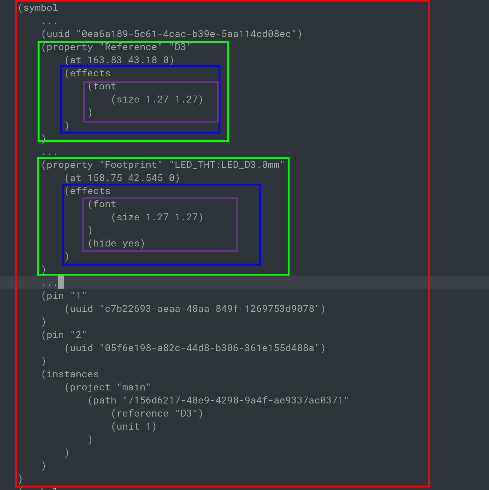

# Технические требования для schPropHide

**Цель**: Разработать микропрограмму осуществляющую изменения видимости полей в kicad схеме.



### Аргументы:

```bash
python schPropHide.py "ФАЙЛ" "ПАРАМЕТРЫ" "ЗНАЧЕНИЕ"
```

Где: 

- Файл в формате `*.kicad_sch`
  
  - Файл который нужно исправить, собственно он входной и выходной

- Параметры - название `property` из файла требующие изменения
  
  - В качестве аргумента передается список, разделитель `,`

- Значение `hide` - может быть `yes`/`no`
  
  - Поля `hide` может отсутствовать, требуется создать его внутри блока `effects`
  
  - Поля `hide` может иметь другое значение в файле,  создавать дубликат поля нельзя, нужно изменить значение существующего.
  
  - Поля `hide` может иметь любое положение внутри блока, например hide может идти раньше font

Примеры команд:

```bash
python schPropHide.py file.kicad_sch "Datasheet,lcsc" "yes"
```

### Требование к реализации:

- Язык программирования `python3`

- Отсутствие внешних зависимостей для `python`, разрешено использовать только встроенные модули (возможно отклонение по согласованию)

- Программа должна запускаться и выполнять свою функцию в среде контейнера `ghcr.io/kicad/kicad:9.0`

- Программа должна иметь интерфейс управления посредством флагов командной строки

- Программа должна принимать/выдавать файл соответствующий примеру (см. приложение)

- В ходе работы в `stdout` должна отправляться информацию об выполненных/проваленных операциях. 

- Все не допустимые комбинации аргументов или неверные значения должны выдавать ошибку и завершать работу программы

- Файлы входные/выходные в кодировке `unix`/`utf8`

- Вся программа должна состоять из одного файла
